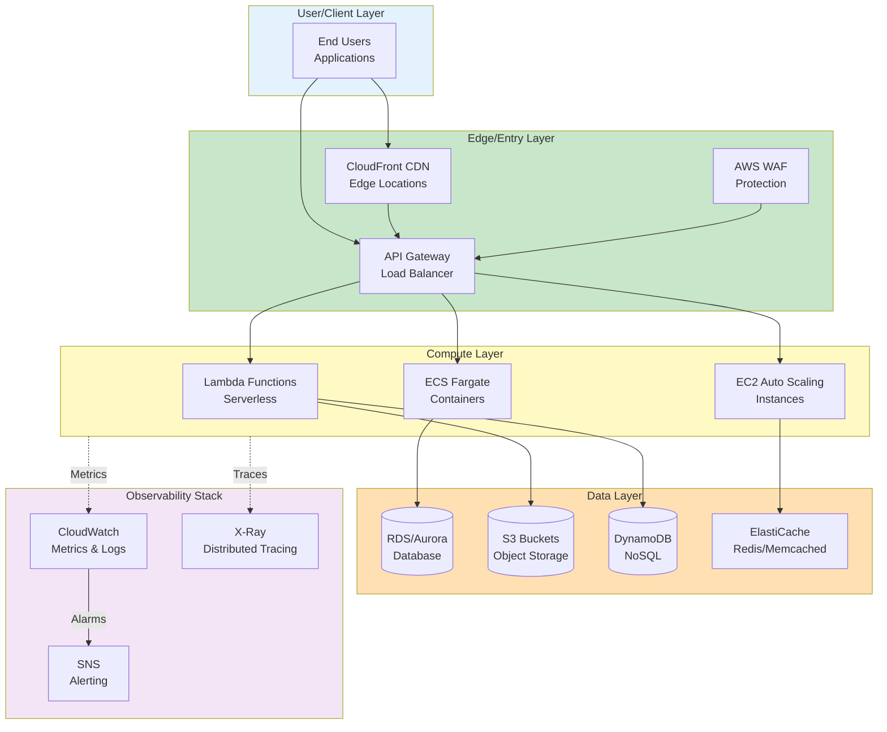
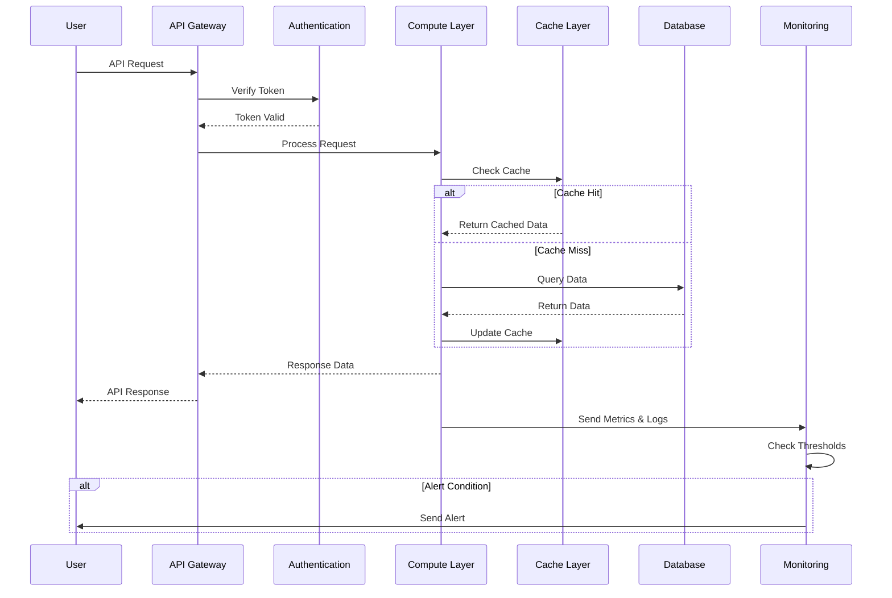
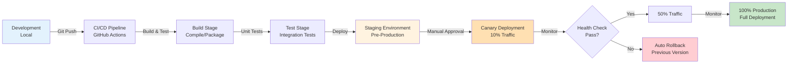
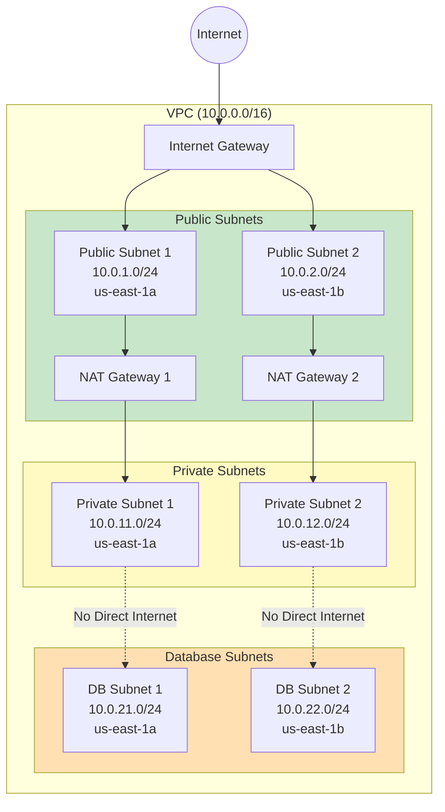

# InfraTales | Serverless Data Lakehouse – Glue + Athena + Delta Lake on AWS

**Production-ready reference architecture for serverless data lakehouse with ACID transactions.**

> **Serverless data lakehouse with AWS Glue, Athena, EMR Serverless, query federation, Delta Lake format, and ACID transactions**

[](LICENSE)
[](CONTRIBUTING.md)
[](https://aws.amazon.com/)
[](https://aws.amazon.com/cdk/)

## 📋 Table of Contents

- [Overview](#-overview)
- [Architecture](#-architecture)
- [Features](#-features)
- [Getting Started](#-getting-started)
- [Deployment](#-deployment)
- [Monitoring](#-monitoring)
- [Security](#-security)
- [Cost](#-cost)
- [License](#-license)

## 🎯 Overview

Serverless data lakehouse with AWS Glue, Athena, EMR Serverless, query federation, Delta Lake format, and ACID transactions

### Key Capabilities
- ✅ High availability and fault tolerance
- ✅ Auto-scaling and cost optimization
- ✅ Security best practices built-in
- ✅ Production-ready monitoring and alerting
- ✅ Infrastructure as Code automation
- ✅ Multi-environment support (dev/staging/prod)

---

## 🏗️ Architecture

### System Architecture



### Data Flow Sequence



### Deployment Pipeline



### Network Architecture



---

## ✨ Features

### Core Features
1. **High Availability**
   - Multi-AZ deployment across availability zones
   - Automatic failover and health checks
   - 99.99% uptime SLA

2. **Auto Scaling**
   - Dynamic scaling based on CPU, memory, and custom metrics
   - Predictive scaling for anticipated load
   - Cost-optimized instance sizing

3. **Security**
   - End-to-end encryption (data at rest and in transit)
   - IAM roles with least privilege access
   - VPC isolation and security groups
   - AWS WAF for application protection
   - CloudTrail audit logging

4. **Monitoring & Observability**
   - CloudWatch dashboards with custom metrics
   - Real-time alerting via SNS/email
   - X-Ray distributed tracing
   - VPC Flow Logs for network monitoring
   - Automated anomaly detection

5. **Cost Optimization**
   - Right-sized EC2 instances
   - Spot instances for non-critical workloads
   - Auto-shutdown of dev/test environments
   - S3 Intelligent-Tiering
   - Reserved instances for predictable workloads

6. **CI/CD Integration**
   - Automated deployment pipeline
   - Infrastructure testing
   - Canary and blue/green deployments
   - Automatic rollback on failures

7. **Disaster Recovery**
   - Automated backups (daily/weekly)
   - Cross-region replication
   - Point-in-time recovery
   - RTO < 1 hour, RPO < 15 minutes

8. **Compliance & Governance**
   - AWS Config rules for compliance
   - Automated compliance reporting
   - Resource tagging strategy
   - Cost allocation tags

---

## 🚀 Getting Started

### Prerequisites

```bash
# AWS CLI
aws --version  # >= 2.13.0

# Configure AWS credentials
aws configure

# Infrastructure tool (depends on project)
# For CDK projects:
node --version     # >= 18.0.0
npm install -g aws-cdk

# For Terraform projects:
terraform version  # >= 1.5.0

# For Pulumi projects:
pulumi version     # >= 3.90.0
```

### Quick Deploy

Refer to the Architecture section above for deployment details.

**Development Environment:**
```bash
# Deploy to dev
./deploy.sh dev
```

**Production Environment:**
```bash
# Deploy to production (requires approval)
./deploy.sh prod
```

---

## 📊 Monitoring

### CloudWatch Dashboards
- **Infrastructure Metrics**: CPU, memory, disk, network
- **Application Metrics**: Request count, latency, errors
- **Custom Metrics**: Business KPIs and domain-specific metrics

### Alerts & Notifications
- High CPU usage (>80% for 5 minutes)
- High error rates (>1% of requests)
- Database connection issues
- Disk space warnings (>85% full)
- Cost anomalies

### Distributed Tracing
- X-Ray integration for request tracing
- Service map visualization
- Latency analysis
- Error tracking

---

## 🔐 Security

### Security Best Practices
- ✅ **Encryption**: All data encrypted at rest (KMS) and in transit (TLS 1.3)
- ✅ **IAM**: Least privilege access with role-based permissions
- ✅ **Network**: VPC isolation, private subnets, security groups
- ✅ **Secrets**: AWS Secrets Manager for credentials
- ✅ **Logging**: CloudTrail for API audit logs
- ✅ **Scanning**: Automated security vulnerability scanning
- ✅ **WAF**: AWS WAF rules for common threats
- ✅ **MFA**: Multi-factor authentication required

### Compliance
- HIPAA compliant infrastructure
- PCI-DSS ready architecture
- SOC 2 controls implemented
- GDPR data protection

---

## 💰 Cost Estimation

### Monthly Cost Breakdown

| Component | Development | Production |
|-----------|-------------|------------|
| Compute (EC2/ECS/Lambda) | $100-300 | $500-2000 |
| Database (RDS/DynamoDB) | $50-150 | $200-1000 |
| Storage (S3/EBS) | $20-50 | $100-500 |
| Networking (Data Transfer) | $10-30 | $50-300 |
| Monitoring (CloudWatch) | $10-20 | $50-200 |
| **Total** | **$190-550** | **$900-4000** |

### Cost Optimization Tips
- Use Spot instances for dev/test (70% savings)
- Enable S3 Intelligent-Tiering
- Set up auto-shutdown for non-prod environments
- Use Reserved Instances for predictable workloads
- Implement proper resource tagging

---

## 📝 License

MIT License - see [LICENSE](LICENSE) file for details

## 🤝 Contributing

See [CONTRIBUTING.md](CONTRIBUTING.md) for contribution guidelines

## 👤 Author

**Rahul Ladumor**
- 🌐 Portfolio: [rahulladumor.in](https://www.rahulladumor.in)
- 💼 GitHub: [@rahulladumor](https://github.com/rahulladumor)
- 📧 Email: rahul.ladumor@infratales.com
- 💬 LinkedIn: [www.linkedin.com/in/rahulladumor](https://www.linkedin.com/in/rahulladumor)

---

<p align="center">
  <strong>⭐ Star this repository if you find it helpful!</strong>
</p>

<p align="center">
  Made with ❤️ by Rahul Ladumor
</p>

<div align="center">
  <a href="https://infratales.com">Website</a> •
  <a href="https://infratales.com/projects">Projects</a> •
  <a href="https://infratales.com/premium">Premium</a> •
  <a href="https://infratales.com/newsletter">Newsletter</a>
</div>
